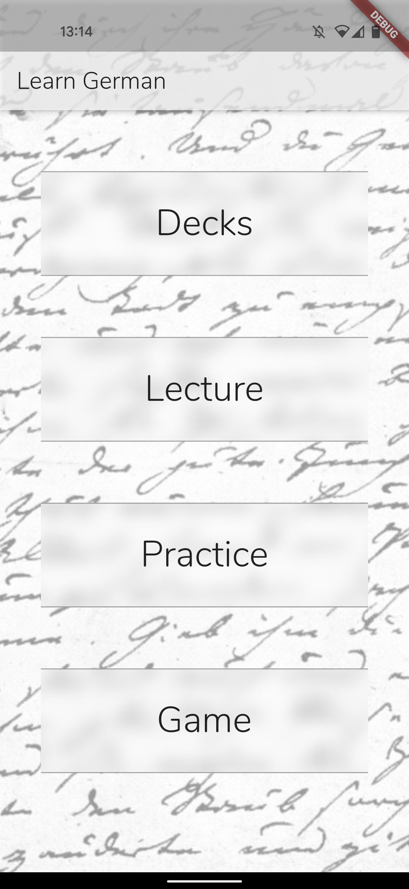
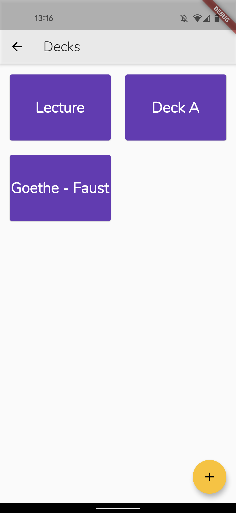
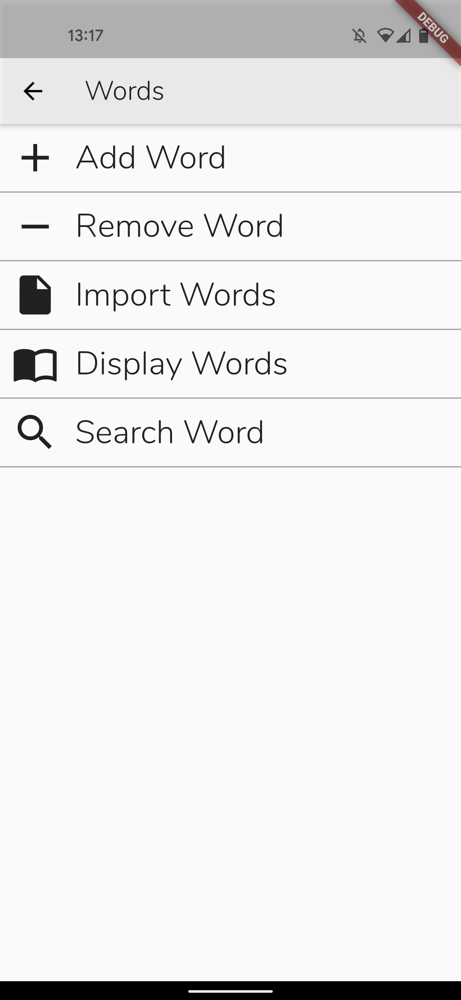
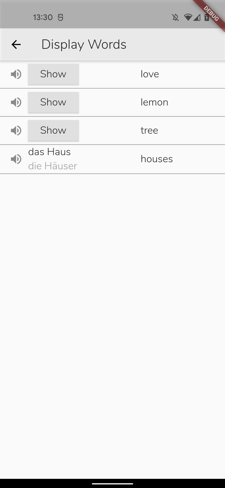
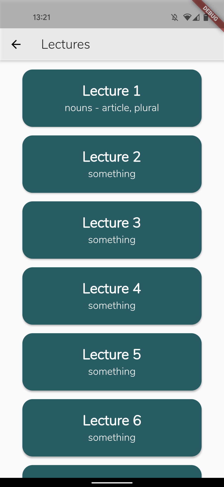
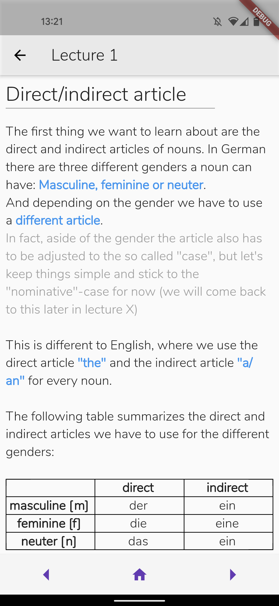

# German-app (in progress)

App for teaching German from English. Programmed with Flutter/Dart.
Database with CRUD operations (Vocabularies) and Lectures for grammar

  
  
  
  
  
  
  
  
  

